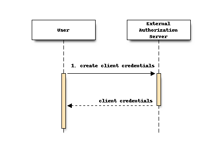
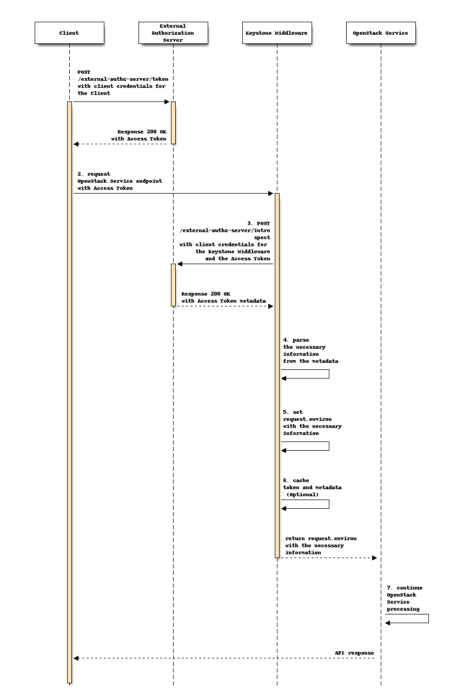

..
 This work is licensed under a Creative Commons Attribution 3.0 Unported
 License.

 http://creativecommons.org/licenses/by/3.0/legalcode

==============================================
External OAuth2.0 Authorization Server Support
==============================================

Provides a capability for the third-party Clients authenticated by an
External Authorization Server via the Client Credentials
Grant in `RFC6749 OAuth 2.0 Authorization Framework` [#oauth2_specification]_
to access the protected OpenStack service directly.

Problem Description
===================

Some OpenStack services allow deploying itself as a standalone service, e.g.,
Tacker, Ironic, etc. In such a situation, users might want to use a third-party
authorization server (such as Keycloak [#keycloak]_). This is theoretically
possible by leveraging OAuth2.0 which has been available from Keystone Zed,
however, is actually not possible yet as the Keystone Middleware only supports
Keystone as an authorization server for the token introspection (a.k.a., the
token validation). Unfortunately, the Keystone Zed doesn't have an effective
way to solve this problem. Thus, to effectively use OAuth2.0, the Keystone
Middleware should support the generic method for token introspection.

Proposed Change
===============

The proposed change is to add a new Keystone Middleware that implements RFC7662
OAuth 2.0 Token Introspection [#token_introspection]_ and allows users to
optionally select that middleware to use an external authorization server.

Terminology
-----------

- *External Authorization Server:* The authorization server that is not
  included in OpenStack services and supports OAuth2.0 Client Credentials
  Grant.  This server handle authentication/authorization for a standalone
  OpenStack service instead of Keystone.

- *User:* The Users that have access to the External Authorization Server and
  are permitted to create OAuth2.0 clients.

- *Client:* The OAuth2.0 clients that use APIs of the External Authorization
  Server. There can be at least two clients: (i) OpenStack clients that obtain
  access tokens via the token API to access the protected
  OpenStack service on behalf of the user; (ii) Keystone Middleware that
  verifies the access token, which is sent from OpenStack clients, on behalf of
  OpenStack services.

- *Access Token:* A OAuth2.0 access token used by the Clients to make protected
  resource requests with the delegated roles from a User.

- *Client credentials:* The credential used by the application with a grant
  type of Client Credentials. With this credential, the application can access
  APIs provided by the External Authorization Server.

.. note:: In the Client Credentials Grant, there is no clear distinction
   between the Users and Clients. The Users and Clients can be replaced with, for
   example, admin users and non-admin users.

Preparation for OAuth2.0 Client Credentials Grant
-------------------------------------------------

The preparation consists of the following step as illustrated in the above
sequence:

#. A User creates a Client with its credentials, and sets up relevant
   information for resource access control, such as roles, groups, scopes,
   tokens, certificates, etc.

OAuth2.0 Client Credentials Grant Flow with External Authorization Server
-------------------------------------------------------------------------

The flow consists of the following steps as illustrated in the above sequence:

#. The Client authenticates with the External Authorization Server and requests
   a new Access Token.

#. The Client uses the Access Token to make requests for OpenStack Service
   APIs.

#. The Keystone Middleware intercepts HTTP calls from the Client and calls an
   introspection API of the External Authorization Server to verify if the
   Access Token is active or not and to obtain the metadata for the Access
   Token. If the validation fails, Keystone Middleware sends an error response
   to the client, such as ``401 Unauthorized``. Prior to the token
   introspection, the Keystone Middleware has to authenticate with the External
   Authorization Server. Although RFC7662 mentioned the methods of such
   authentication as out of scope, it is natural to assume OAuth2.0 Client
   Credentials Grant is used. In this sense, Keystone Middleware needs to
   support the multiple authentication methods that is generally supported by
   the authorization servers, such as ``tls_client_auth``,
   ``client_secret_basic``, ``client_secret_post``, ``client_secret_jwt``,
   ``private_key_jwt``, etc. This step is skipped if unexpired token cache
   which is described later is available.

#. The Keystone Middleware uses the mapping definition in the config file to
   parse all the necessary information from the metadata. If the parsing fails,
   the Keystone Middleware sends an error response such as ``403 Forbidden`` to
   the Client. In the case where unexpired token cache which is described later
   is available, Keystone Middleware loads metadata from memcache server.

#. Keystone Middleware sets the environment variables in the OpenStack service
   HTTP request with the required information.

#. In the case, a memcache server [#memcache]_ is configured, Keystone
   Middleware cache a token.

#. After the verification of the access token, the OpenStack service applies
   the matching policy according to the request environment variable, and
   continues the subsequent business processing. If the environment variable
   doesn't match the policy to access the requested resources, OpenStack
   Service returns an error response such as ``403 Forbidden``. Finally, it
   sends the response to the Client.

.. note::
  OAuth2.0 doesn't support users who are associated with multiple tenants like
  the project of OpenStack. Therefore, this feature assumes that users
  registered on an external authorization server are associated only with a
  single tenant (e.g., realms in Keycloack).

.. note::
  This feature only support the authorization servers that can provide enough
  information for OpenStack services to work correctly. At least,
  ``user_role``, ``project`` and ``user_domain`` should be included in the
  metadata of token introspection.

Alternatives
------------

* The delegated mode in the Keystone Middleware [#delegated_mode]_ can be used
  to handle request that needs an external authorization server. In this case,
  no changes to the Keystone Middleware are needed and an API server will
  perform the token introspection instead. However, the proposed features in
  the present document doesn't impair the current Keystone Middleware, but
  rather is beneficial feature for the OpenStack users who want to use
  OAuth2.0.

* The Keystone already cover the authentication in the stand alone mode service
  by supporting the basic authentication in the keystoneauth [#basic]_.
  However, the basic authentication is now no longer secure.

Security Impact
---------------

* During the OAuth2.0 Client Credentials Grant flow, some sensitive values are
  sent in plain text. Therefore, it is recommended for users configure
  keystonemiddleware to use HTTPS-enabled endpoint for the token introspection.

Notifications Impact
--------------------

None

Other End User Impact
---------------------

* Enables the use OAuth2.0 access token for the External Authorization Server
  from the settings of Keystone Middleware without using API.  These
  configurations are shown in the part of Other Deployer Impact.

Performance Impact
------------------

None

Other Deployer Impact
---------------------

Configuration of Keystone Middleware
~~~~~~~~~~~~~~~~~~~~~~~~~~~~~~~~~~~~

To use OAuth2.0 access token for the External Authorization Server, a deployer
has to configure Keystone Middleware by changing ``[filter:authtoken]`` in
``/etc/tacker/api-paste.ini`` as shown below.

::

  [filter:authtoken]
  paste.filter_factory=keystonemiddleware.external_oauth2_token:filter_factory

.. note:: If the Openstack services require authorization to an external
   authorization server through Keystone Middleware, the config for each
   service must be changed. This section shows how to set up Tacker as an
   example.

In order for Keystone Middleware to access the External Authentication Server
for token verification and to obtain metadata, users has to configure Keystone
Middleware by appending some options in ``/etc/tacker/tacker.conf`` as shown
below. In this example, the Keycloak is the external authorization server.
Regarding the option ``auth_method`` can be the following methods:
``tls_client_auth``, ``client_secret_basic``, ``client_secret_post``,
``client_secret_jwt``, ``private_key_jwt``. The fields named ``mapping_*``
specify the mapping between metadata obtained from External Authorization
Server to OpenStack Services variables. For example, with
``mapping_project_id=tenant_id``, Keystone Middleware retrieves a value with a
key ``tenant_id`` from the metadata returned from the authorization server and
sets that value as an environment variable ``HTTP_X_PROJECT_ID`` in a request.
Also note that a memcache server can be configured with the
``memcached_servers`` attribute in the same way as the current
keystonemiddleware.

::

  [keystone_authtoken]
  memcached_servers=localhost:11211
  introspect_endpoint=https://keycloak/protocol/openid-connect/token/introspect
  auth_method=client_secret_basic
  client_id=tacker_client_id
  client_secret=tacker_client_secret
  jwt_key_file=/opt/stack/jwt.pem
  jwt_algorithm=S256
  # the mapping from metadata obtained from External Authorization Server to OpenStack Services variables
  mapping_project_id=tenant_id
  mapping_project_name=tenant_name
  mapping_project_domain_id=domain_id
  mapping_project_domain_name=domain_name
  mapping_user_id=user_id
  mapping_user_name=username
  mapping_user_domain_id=domain_id
  mapping_user_domain_name=domain_name
  mapping_roles=roles
  audience=https://<keycloak_host>:<port>/realms/<realm_name>
  jwt_bearer_time_out=3600
  # In the case where mTLS OAuth2.0 is used, the following variables also have to be set
  # auth_method=tls_client_auth
  # cacert=/opt/stack/keycloak_ca.pem
  # key=/opt/stack/tacker_client.key
  # cert=/opt/stack/tacker_client.pem

Developer Impact
----------------

* Developers should create appropriate mapping rules between user attributes
  (such as tenant names) defined in an external authorization server they want
  to use and attributes used by OpenStack service for the access control

* There is no impact on other Openstack developers and backend services unless
  they want to use OAuth2.0 with an External Authorization Server.

.. warning:: Some OpenStack services might have to change their codes to use
   this plugin. The most likely reason for such changes is the lack of a
   service catalog. The services using other services APIs have to get the
   similar information that service catalog provides in the different way, for
   example, getting them from configuration.

Implementation
==============

Assignee(s)
-----------

Primary assignee:
  * Hiromu Asahina (hiromu a.k.a h-asahina) <hiromu.asahina.az@hco.ntt.co.jp>

Other contributors:
  * Yuta Kazato (yuta-kazato) <yuta.kazato.nw@hco.ntt.co.jp>
  * Yusuke Niimi <niimi.yusuke@fujitsu.com>
  * Keiichiro Yamakawa <yamakawa.keiich@fujitsu.com>

Work Items
----------

* Add a new Keystone Middleware that can send Introspection Request
  in RFC7662 Sec. 2.1 and can retrieve necessary metadata for
  an API server from Introspection Response in RFC7662 Sec. 2.2
* Add unit tests for the new Keystone Middleware
* Add integration test cases (e.g., tempest [#tempest]_) for the new Keystone
  Middleware
* Change API Keystone Middleware documentation.

Dependencies
============

None

Documentation Impact
====================

* We would need to update API Keystone Middleware documents
  and Middleware Architecture.

References
==========

.. [#oauth2_specification] https://tools.ietf.org/html/rfc6749
.. [#keycloak] https://www.keycloak.org/
.. [#token_introspection] https://datatracker.ietf.org/doc/html/rfc7662
.. [#memcache] https://docs.openstack.org/keystonemiddleware/latest/middlewarearchitecture.html#improving-response-time
.. [#delegated_mode] https://docs.openstack.org/keystonemiddleware/latest/middlewarearchitecture.html
.. [#tempest] https://docs.openstack.org/tempest/latest/index.html
.. [#basic] https://docs.openstack.org/keystoneauth/latest/plugin-options.html#http-basic
